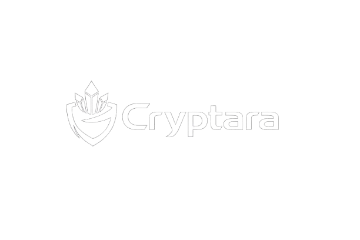

# 🔐 Cryptara — Client-Side Text Encryption Tool



> Military-grade AES-256 encryption running entirely in your browser. Your data never leaves your device.

---

## 📋 Overview

**Cryptara** is a responsive, browser-based text encryption tool built with vanilla HTML, CSS, and JavaScript. It uses the [CryptoJS](https://cryptojs.gitbook.io/docs/) library to implement **AES-256-CBC** encryption with secure key derivation via **PBKDF2-SHA256**.

All cryptographic operations happen **100% client-side** — no servers, no data transmission, no tracking.

---

## ✨ Features

| Feature | Details |
|---|---|
| **AES-256 Encryption** | Uses AES-256-CBC, the same standard used by banks and governments |
| **Secure Key Derivation** | PBKDF2-SHA256 with 10,000 iterations + random salt |
| **Random IV per Encryption** | A unique 128-bit Initialization Vector is generated every time |
| **Client-Side Only** | Zero data leaves your device |
| **Decrypt Mode** | Paste any Cryptara-encrypted ciphertext and recover plaintext |
| **Graceful Error Handling** | Clear messages for wrong passphrase or corrupted ciphertext |
| **Responsive Design** | Works on desktop, tablet, and mobile |
| **Passphrase Strength Hint** | Visual indicator for passphrase quality |
| **Copy to Clipboard** | One-click copy of output |
| **Keyboard Shortcut** | `Ctrl+Enter` / `Cmd+Enter` to run encryption/decryption |

---

## 🚀 Getting Started

### Option 1 — Open locally (no server needed)

1. Download or clone this repository.
2. Open `index.html` in any modern browser.
3. Start encrypting!

```bash
git clone https://github.com/your-username/client-side-encryption-tool.git
cd client-side-encryption-tool
open index.html   # macOS
# or double-click index.html on Windows/Linux
```

### Option 2 — Serve with a local server (recommended for dev)

```bash
# Python 3
python -m http.server 8080

# Node.js (npx)
npx serve .
```

Then visit `http://localhost:8080`.

---

## 🔐 How It Works

### Encryption Process

```
Passphrase + Random Salt (128-bit)
        │
        ▼  PBKDF2-SHA256 (10,000 iterations)
     AES-256 Key (256-bit)
        │
        ▼  AES-256-CBC with random IV (128-bit)
     Ciphertext
        │
        ▼  Base64 encoding
     Output: saltHex | ivHex | ciphertextBase64
```

### Ciphertext Format

The output string follows this pipe-delimited format:

```
<saltHex(32)>|<ivHex(32)>|<ciphertextBase64>
```

- **Salt** — 32 hex characters (16 bytes). Used with your passphrase to derive the AES key via PBKDF2.
- **IV** — 32 hex characters (16 bytes). Random Initialization Vector for AES-CBC mode.
- **Ciphertext** — Base64-encoded encrypted bytes.

### Decryption Process

1. Parse the three components from the ciphertext string.
2. Re-derive the AES key from your passphrase + the stored salt (PBKDF2).
3. Decrypt using the stored IV.
4. Return the original plaintext.

> ⚠️ If the passphrase is wrong, decryption fails and an error is shown — no partial or misleading output.

---

## 📂 Project Structure

```
client-side-encryption-tool/
│
├── index.html          # Main HTML — structure and layout
├── css/
│   └── style.css       # Stylesheet: Noto Sans, color scheme, responsive design
├── js/
│   └── script.js       # Encryption/decryption logic, DOM handling
├── assets/
│   ├── logo.png        # Cryptara logo (shield/crystal design)
│   ├── favicon.png     # Browser tab icon
│   ├── demo1.png       # Screenshot: encryption view
│   └── demo2.png       # Screenshot: decryption view
└── README.md           # This file
```

---

## 🎨 Design System

### Colour Palette

| Token | Hex | Usage |
|---|---|---|
| `--black` | `#0A090C` | Background, primary dark surface |
| `--white` | `#F0EDEE` | Primary text, light surfaces |
| `--deep-teal` | `#07393C` | Button gradients, info icons |
| `--mid-teal` | `#2C666E` | Active states, borders |
| `--sky` | `#90DDF0` | Accent, labels, highlights |

### Typography

- **Font:** [Noto Sans](https://fonts.google.com/ntype/noto-sans) (Google Fonts)
- **Weights used:** 300 (light), 400 (regular), 600 (semibold), 700 (bold), 900 (black)

### Icons

Uses [Font Awesome 6](https://fontawesome.com/) via CDN:
- `fa-lock` — Encrypt action
- `fa-unlock` — Decrypt action
- `fa-key` — Passphrase input
- `fa-shield-alt` — Security branding
- `fa-copy` — Copy to clipboard
- `fa-check-circle` — Success feedback
- `fa-circle-xmark` — Error feedback

---

## 🛡️ Security Notes

| Consideration | Implementation |
|---|---|
| **Key derivation** | PBKDF2-SHA256 with 10,000 iterations — makes brute-force slow |
| **Random salt** | New 128-bit salt per encryption — prevents rainbow table attacks |
| **Random IV** | New 128-bit IV per encryption — prevents pattern analysis |
| **No storage** | Passphrase is never stored, logged, or transmitted |
| **Client-side** | CryptoJS runs entirely in the browser |
| **CBC mode** | AES-256-CBC with PKCS7 padding |

> **Important:** The security of your encrypted data depends entirely on the strength of your passphrase. Use a long, random passphrase for maximum security.

---

## 📸 Screenshots

### Encryption View


### Decryption View


---

## 🔧 Dependencies

All loaded via CDN — no npm/build step required:

| Library | Version | Purpose |
|---|---|---|
| [CryptoJS](https://cryptojs.gitbook.io/docs/) | 4.2.0 | AES-256 encryption/decryption, PBKDF2 |
| [Font Awesome](https://fontawesome.com/) | 6.5.0 | UI icons |
| [Noto Sans](https://fonts.google.com/) | — | Typography |

---

## 🙏 Credits

- **Brand & Logo Design** — Cryptara
- **Cryptography** — [CryptoJS](https://github.com/brix/crypto-js)
- **Icons** — [Font Awesome](https://fontawesome.com/)
- **Fonts** — [Google Fonts](https://fonts.google.com/)

---

*Cryptara — Encrypt. Protect. Decrypt.*
